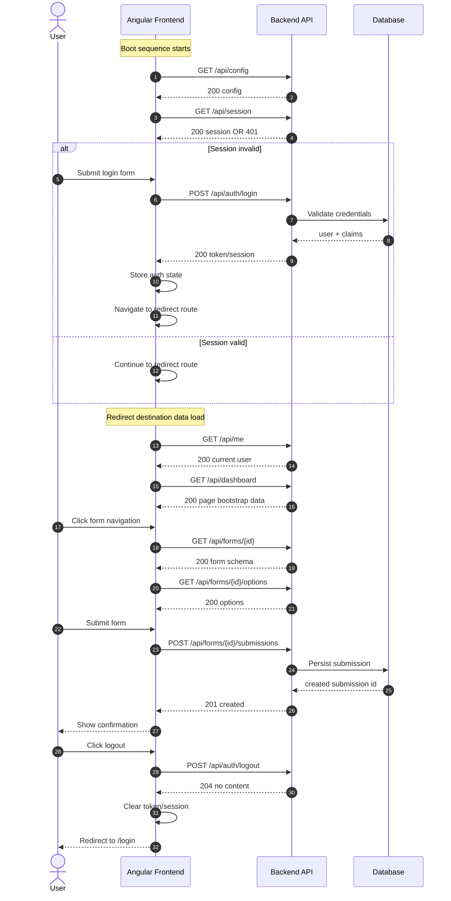
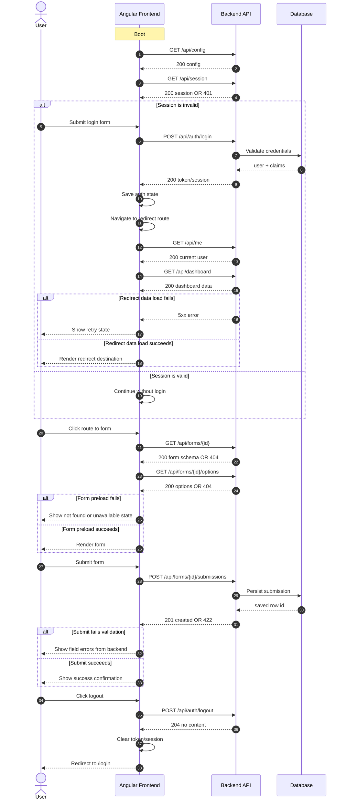

# API Sequence Diagram + Documentation Boilerplate (Angular -> Backend)

Use this as a copy/paste template for documenting API call order by app boot and user navigation clicks.

Companion specs:

- Security audit runbook: [api-security-audit-spec.md](api-security-audit-spec.md)
- Dotnet user secrets machine runbook: [dotnet-user-secrets-machine-spec.md](dotnet-user-secrets-machine-spec.md)

## 1) Mermaid Sequence Diagram (Primary Template)



## 2) Mermaid Sequence Diagram (Expanded With Error Branches)



## 3) API Documentation Boilerplate (Fill-In)

## Overview

- Frontend app: [Angular app name]
- Backend service: [API service name]
- Environment: [local/dev/stage/prod]
- Base URL: [https://api.example.com]
- Auth model: [JWT cookie, bearer token, session cookie]

## Boot Sequence

1. Frontend initializes runtime config.
2. Frontend checks existing auth session.
3. Frontend routes to login or to redirect target.

## Navigation Flows

### Flow A: Login -> Redirect

1. User opens login page.
2. Frontend calls login endpoint.
3. Backend validates credentials and returns auth artifact.
4. Frontend stores auth artifact and redirects.
5. Frontend loads user/profile data for redirected destination.

### Flow B: Navigate To Form -> Submit

1. User clicks form route.
2. Frontend loads form schema and options.
3. User submits form data.
4. Backend validates and persists submission.
5. Frontend shows success and optional redirect.

### Flow C: Logout

1. User clicks logout.
2. Frontend calls logout endpoint.
3. Backend invalidates session/token.
4. Frontend clears local auth state and navigates to login.

## Endpoint Inventory

| Step | Trigger | Method | Endpoint | Request Body | Success | Failure | Notes |
|---|---|---|---|---|---|---|---|
| Boot 1 | App load | GET | /api/config | None | 200 | 5xx | Runtime flags |
| Boot 2 | App load | GET | /api/session | None | 200 | 401 | Session check |
| Login 1 | Login submit | POST | /api/auth/login | credentials | 200 | 400/401 | Returns token/cookie |
| Redirect 1 | Post-login | GET | /api/me | None | 200 | 401 | Current user |
| Redirect 2 | Post-login | GET | /api/dashboard | None | 200 | 4xx/5xx | Initial page data |
| Form 1 | Route enter | GET | /api/forms/{id} | None | 200 | 404 | Form schema |
| Form 2 | Route enter | GET | /api/forms/{id}/options | None | 200 | 404 | Select options |
| Form 3 | Submit | POST | /api/forms/{id}/submissions | form payload | 201 | 400/422 | Validation + persist |
| Logout 1 | Logout click | POST | /api/auth/logout | None | 204 | 401 | Session invalidate |

## Payload Contracts

### Login Request

```json
{
  "email": "user@example.com",
  "password": "string"
}
```

### Login Response (Example)

```json
{
  "token": "jwt-or-session-reference",
  "expiresAt": "2026-04-13T09:00:00Z",
  "user": {
    "id": "u_123",
    "displayName": "Example User"
  }
}
```

### Form Submission Request

```json
{
  "formId": "f_123",
  "fields": {
    "firstName": "Jane",
    "lastName": "Doe",
    "consent": true
  }
}
```

### Form Submission Response

```json
{
  "submissionId": "sub_123",
  "status": "accepted"
}
```

## Validation + Error Mapping

| Endpoint | Input Validation | Error Code | UI Behavior |
|---|---|---|---|
| /api/auth/login | required email/password | AUTH_401 | Show invalid credentials |
| /api/forms/{id}/submissions | schema + business rules | FORM_422 | Highlight invalid fields |
| /api/auth/logout | active session | AUTH_401 | Force local logout anyway |

## Observability Checklist

- Correlation ID propagated from frontend to backend.
- Request/response timing captured for all listed endpoints.
- Login, form submit, and logout events are audited.
- Failed calls include actionable error codes for UI mapping.

## Test Scenarios

1. Login with valid credentials redirects correctly.
2. Login with invalid credentials shows field-level error.
3. Direct navigation to protected route without session redirects to login.
4. Form schema and options load before submit becomes enabled.
5. Valid form submit returns success and confirmation message.
6. Invalid form submit maps backend errors to UI fields.
7. Logout clears auth state and blocks protected routes.

## Email Snapshot (Copy/Paste)

Subject: Angular API Sequence Diagram - Boot, Login, Redirect, Form Submit, Logout

Body:
- Attached is the flow map and endpoint inventory for frontend-to-backend calls.
- Includes request order by app boot and click navigation.
- Covers login, redirect loading, form navigation + submission, and logout.
- Next step: replace template endpoints with actual environment values and response contracts.
